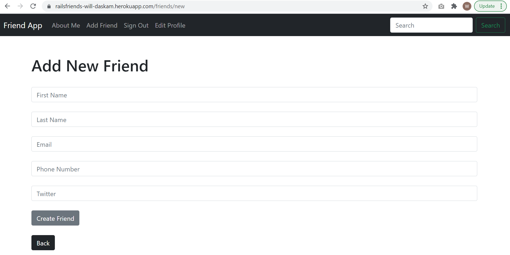

# Friends List App

Platform that allows users to create an account and set up a friends list that includes the friends name, email, phone number, and twitter. Users can search the list for a specific friend, add new friends, delete friends and update friends information. Users are also able to cancel their account or update their account information.

## Getting Started

These instructions will get you a copy of the project up and running on your local machine for development and testing purposes.

1. First clone the git repository, copy the url, and run 'git clone paste-url-here' in your coding environment. 

2. From here, you will need to run 'bundle install' and 'rails db:create' to install the necessary gems and create the initial databse respectively. Make sure to also run 'rails db:migrate' to ensure the database is up to date with all the migrations. 

3. Once the database is created, you should be able to get the project up and running on your local machine.

## Deployed Version of the App:

https://railsfriends-will-daskam.herokuapp.com/

## Built With

* [Bootstrap](https://getbootstrap.com/) - The web framework used

* Ruby version: 2.7.4

## Author

* **Will Daskam** 